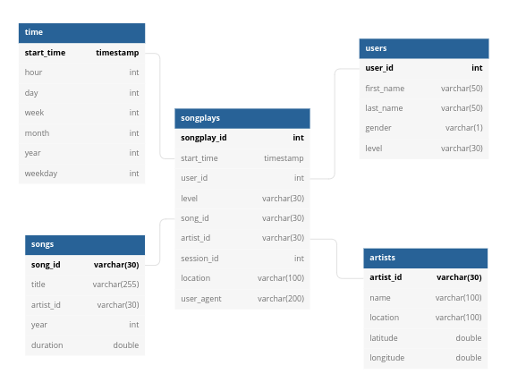
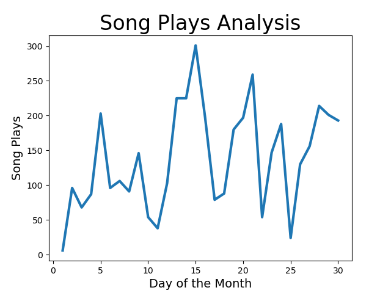

# Project: Data Warehouse 
## Introduction
A music streaming startup, Sparkify, has grown their user base and song database and want to move their processes and data onto the cloud. Their data resides in S3, in a directory of JSON logs on user activity on the app, as well as a directory with JSON metadata on the songs in their app.

They'd like a data engineer to build an ETL pipeline that extracts their data from S3, stages them in Redshift, and transforms data into a set of dimensional tables for their analytics team to continue finding insights in what songs their users are listening to. 

## File Structure

```
.Project Folder
├── create_redshift_cluster.py
├── create_tables.py
├── dwh.cfg
├── etl.py
├── sql_queries.py
├── visualization.py
```

## Data Modeling
Two staging tables will be used in Redshift to hold the data extracted from S3. These include:
- staging_events
- staging_songs

The schema for this project has been modeled using a star schema. This wil allow optimized queries for analysis. The tables include:
1. Fact Table: 
- songplays - records in log data associated with song plays 
2. Dimension Tables
- users - users in the app
- songs - songs in music database
- artists - artists in music database
- time - timestamps of records in songplays broken down into specific units




## ETL Pipeline
The ETL pilpline is built with python. The etl.py script extracts the data from the json files located in the data directory. This data is processed, cleaned, and inserted into the fact and dimension tables. 

## How to Run this Project
1. Create a Reshift Cluster using the GUI on AWS. Alternatively run the python script "create_redshift_cluster.py". Note this will require you to have done the configuration indicated below in step 2.
2. Update the configuration file "dwh.cfg" with the details listed below:
- AWS KEY and SECRET
- Database Host
- ARN from the AWS IAM

Navigate to the project folder and excute the python scripts in the following sequence:
1. python3 create_tables.py
2. python3 etl.py
3. python3 visualization.py

Note: You have to run create_tables.py once to create the tables that the etl.py uses.

## Sample Queries for song play analysis
1. Top 10 Played Songs
```
SELECT COUNT(sp.songplay_id) no_of_songplays, sg.song_id, sg.title, ar.name "artist_name"
FROM songplays sp
JOIN songs sg ON sp.song_id = sg.song_id
JOIN artists ar on sp.artist_id = ar.artist_id
JOIN time t ON sp.start_time = t.start_time
WHERE t.year = 2018 AND t.month = 11
GROUP BY sg.song_id, sg.title, ar.name
ORDER BY no_of_songplays DESC
LIMIT 10;
```

2. Top 10 active users 
```
SELECT COUNT(sp.songplay_id) no_of_songplays, us.user_id, us.first_name, us.last_name
FROM songplays sp
JOIN users us ON sp.user_id = us.user_id
JOIN time t ON sp.start_time = t.start_time
WHERE t.year = 2018 AND t.month = 11
GROUP BY us.user_id, us.first_name, us.last_name
ORDER BY no_of_songplays DESC
LIMIT 10;
```

## Visualization
The script visualization.py generates a line graph based on the data stored in the fact and dimension tables. This analysis shows the number of songs played in the course of the month (Nov 2018). 

Below is the output.

